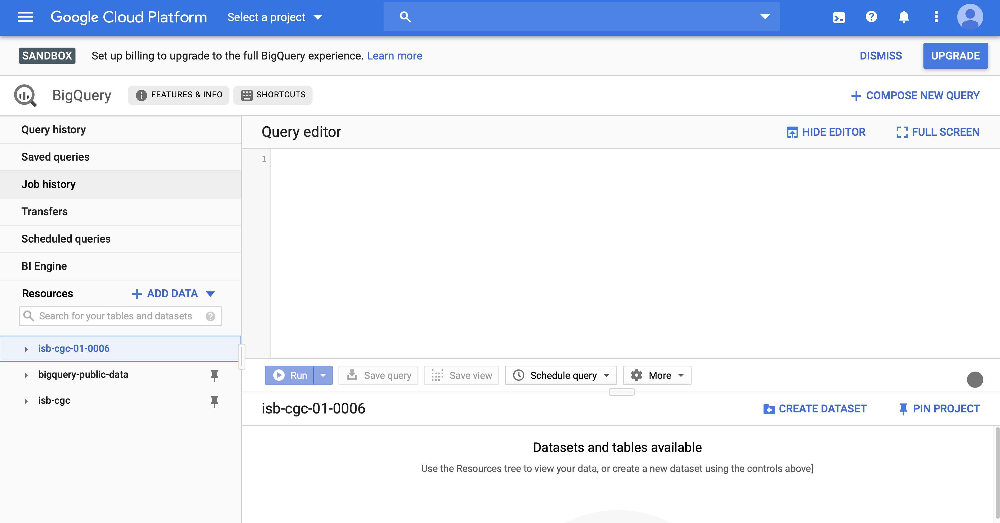
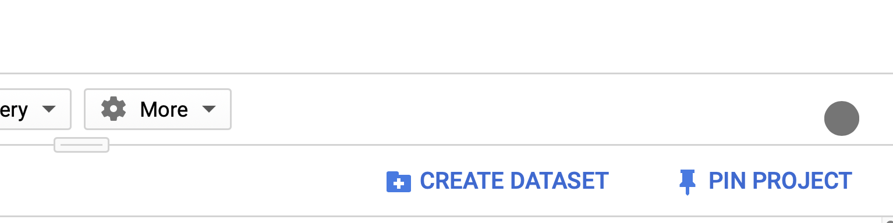

Bigquery is a cloud service run by Google. To begin using Bigquery, you
need to establish an account. In this section, we will be ensuring that
you have some form of access to Bigquery.

Set up access
-------------

-   If you *do not have a Google Cloud Platform account*, move to [No
    existing GCP account](#no-existing-gcp-account)
-   If you *have a Google Cloud Platform account*, skip to [Existing GCP
    account or project](#existing-gcp-account-or-project)

### No existing GCP account

If you do not have such an account, you can [get started using the GCP
free trial](https://cloud.google.com/free/).

After creating a new account, there are two options to get going, using
the free [Bigquery
sandbox](https://cloud.google.com/bigquery/docs/sandbox) (that is
subject to some quotas and limitd) or creating a GCP project, allowing
you to use credits or charge to your account.

The BigQuery sandbox is available to anyone with a Google Cloud Platform
account. It gives free access to the power of BigQuery subject to the
sandbox’s
[limits](https://cloud.google.com/bigquery/docs/sandbox#limits). The
sandbox allows use of the web UI in the Cloud Console without providing
a credit card. Use the sandbox without creating a billing account or
enabling billing for your project.

The web UI is the graphical interface used to create and manage BigQuery
resources and to run SQL queries.

1.  [Open the sandbox](https://console.cloud.google.com/bigquery).
2.  Accept the terms of service.
3.  Before you can use the BigQuery sandbox, you must create a project.
    Follow the prompts to create your new project.
4.  After you create your project, the BigQuery web UI will display a
    sandbox banner like the following.

While using the sandbox, there is no need to create a billing account
(i.e., no need to supply a credit card), and you do not need to attach a
billing account to the project.

### Existing GCP account or project

*If you have a Google Cloud Platform billing account already*, you can
choose to either create a new project and use it or choose an existing
project. Unlike the Bigquery sandbox, using a project with billing
attached means that 1) the account will accrue charges and 2) usage will
not be subject to the Sandbox limits.

Access the OmicIDX Bigquery Dataset
-----------------------------------

Navigate to the [Bigquery dataset on Google Cloud
Platform](https://console.cloud.google.com/bigquery?project=isb-cgc-01-0006&folder&organizationId&p=isb-cgc-01-0006&d=omicidx&page=dataset).

The Bigquery console is an online portal that allows basic queries and
data exploration of BigQuery datasets. Upon opening the OmicIDX BigQuery
link, the console should open with the OmicIDX dataset already available
in the dataset window.

The OmicIDX dataset appears in the left “dataset” window.

<!--html_preserve-->
{} After clicking on the OmicIDX dataset in
the navigation window, “pinning” the OmicIDX dataset will keep it
available when you come back to Bigquery. You can always click the link
above again if you forget. {}<!--/html_preserve-->

Clicking the “pin” button on the right will keep the OmicIDX dataset in
your dataset navigator for easy access.

Next steps
----------

At this point, you should have access to Bigquery and the OmicIDX
dataset. In the next section, we will explore using the web UI to
explore the OmicIDX dataset.
