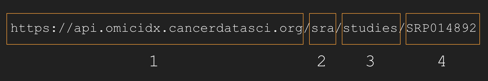

RESTful Concepts
----------------

Before focusing on any jargon or getting hung up on semantics, in the
case of the OmicIDX REST API, three components to the system are
important.

The first is that REST systems are typically composed of *resources*.
Any information that can be named can be a resource: a document or
image, a temporal service, a collection of other resources, a
non-virtual object (e.g. a person), and so on. In the OmicIDX case,
typical resources are things like:

-   SRA Runs
-   SRA Studies
-   Biosample Sample records
-   SRA Experiments
-   SRA Samples
-   GEO Platforms
-   GEO Samples
-   GEO Series (studies)

REST uses a resource identifier to “name” the particular resource
involved in an interaction. In OmicIDX, these resource identifiers are
typically accessions, like *SRR000273*, *SRX000273*, or *SAMND00000001*.

A REST API accesses *resources* via *http* calls. For example, to access
a specific SRA study record, one can use a URL like:

<https://api.omicidx.cancerdatasci.org/sra/studies/SRP014892>

Accessing the URL from the linux command-line program using a program
like `curl` leads to facile programmatic access. More on programmatic
access follows.

REST is acronym for **RE**presentational **S**tate **T**ransfer. It is
architectural style for distributed systems and was first presented by
Roy Fielding in 2000 in his [famous
dissertation](https://www.ics.uci.edu/~fielding/pubs/dissertation/rest_arch_style.htm).

<!--html_preserve-->
{} When viewing API results in the browser by,
for example, clicking on the examples in this documentation, a browser
plugin such as the Chrome JSON Viewer can enhance the experience quite
significantly. {}<!--/html_preserve-->

Retrieving records by accession
-------------------------------

All of the common public omics data repositories include *accessions*
for their records. These accessions serve as keys in *OmicIDX*, so they
can be reused easily for quick lookup of records. When the accession is
known (such as when you find the accession in a pubmed abstract),
retrieving the metadata for that accession is a common task. OmicIDX
uses accessions from the original database, so eee table @ref(tab:tab1)
for examples of what to look for.

<table>
<caption>(#tab:tab1) This table outlines the <em>resources</em> and the <em>resource identifiers, or accessions,</em> in OmicIDX. Note how the format of the accessions differs across resources. The “type of record” column has multiple <em>Sample</em> entries, for example, but each repository (GEO, SRA, Biosample, etc.) has a unique data model. More details on the data models are in the [SRA], [GEO], and [Biosample] sections.</caption>
<thead>
<tr class="header">
<th>Database</th>
<th>Example accession</th>
<th>Type of record</th>
</tr>
</thead>
<tbody>
<tr class="odd">
<td>SRA</td>
<td><code>SRP012682</code></td>
<td>Study</td>
</tr>
<tr class="even">
<td>SRA</td>
<td><code>SRS357840</code></td>
<td>Sample</td>
</tr>
<tr class="odd">
<td>SRA</td>
<td><code>SRX178456</code></td>
<td>Experiment</td>
</tr>
<tr class="even">
<td>SRA</td>
<td><code>SRR543404</code></td>
<td>Run</td>
</tr>
<tr class="odd">
<td>Biosample</td>
<td><code>SAMD00000001</code></td>
<td>Sample</td>
</tr>
<tr class="even">
<td>GEO</td>
<td><code>GSM10</code></td>
<td>Sample</td>
</tr>
<tr class="odd">
<td>GEO</td>
<td><code>GSE2553</code></td>
<td>Study (or Series)</td>
</tr>
<tr class="even">
<td>GEO</td>
<td><code>GPL96</code></td>
<td>Platform</td>
</tr>
</tbody>
</table>

### Get an individual record by accession

URLs for accessing individual records in OmicIDX follow a standard form
and are easy to construct. See Figure @ref(fig:urldiagram) for details.

(ref:urldiagram) OmicIDX URLs to access omics metadata *resources* by
accession follow a pattern. In the diagramatic representation of an
OmicIDX URL, box 1 is the server name. Box 2 is the originating database
which is, in this case, the \[SRA\] database. Box 3 is the name of the
resource within the originating database, here the studies collection.
Finally, box 4 is the accession. Note that no `/` follows the accession.

    

(ref:urldiagram)

For example, the SRA accession for the GTeX study is `SRP012682`. This
accession comes from the `sra` database and is a `study`, so we query
the following URL:

-   <https://api.omicidx.cancerdatasci.org/sra/studies/SRP012682>

Clicking on the link will return JSON results for the study record for
the GTeX study. Alternatively, one can use `curl` on the command line to
access the same URL.

    curl -s 'https://api.omicidx.cancerdatasci.org/sra/studies/SRP012682'

While `curl` will work fine to get results, the [httpie
tool](https://httpie.org/) is a friendlier tool for querying web APIs.
[Installation is straightforward](https://httpie.org/#installation).

    http 'https://api.omicidx.cancerdatasci.org/sra/studies/SRP012682' \
        --pretty format

    ## {
    ##     "BioProject": "PRJNA75899", 
    ##     "abstract": "Lay Description.  The aim of the Genotype-Tissue Expression (GTEx) Project is to increase our understanding of how changes in our genes affect human health and disease with the ultimate goal of improving health care for future generations. GTEx will create a database that researchers can use to study how inherited changes in genes lead to common diseases.  GTEx researchers are studying genes in different tissues obtained from many different people. The GTEx project also includes a study of the GTEx donor consent process - this study will help ensure that the consent process and other aspects of the project effectively address the concerns and expectations of participants in the study. GTEx is a pioneering project that uses state-of-the-art protocols for obtaining and storing a large range of organs and tissues, and for testing them in the lab. Until now, no project has analyzed genetic variation and expression in as many tissues from the same person in... (for more see dbGaP study page.)", 
    ##     "accession": "SRP012682", 
    ##     "alias": "phs000424", 
    ##     "attributes": [
    ##         {
    ##             "tag": "parent_bioproject", 
    ##             "value": "PRJNA75897"
    ##         }
    ##     ], 
    ##     "center_name": "dbGaP", 
    ##     "experiment_count": "24588", 
    ##     "identifiers": [
    ##         {
    ##             "id": "PRJNA75899", 
    ##             "namespace": "BioProject"
    ##         }, 
    ##         {
    ##             "id": "phs000424", 
    ##             "namespace": "dbGaP"
    ##         }, 
    ##         {
    ##             "id": "phs000424", 
    ##             "namespace": "dbGaP"
    ##         }
    ##     ], 
    ##     "insdc": true, 
    ##     "lastupdate": "2017-09-17T10:26:44", 
    ##     "mean_bases_per_run": 14030484634.422861, 
    ##     "published": "2014-02-14T22:56:17", 
    ##     "pubmed_ids": [], 
    ##     "received": "2012-05-04T15:43:05", 
    ##     "run_count": "24588", 
    ##     "sample_count": "14249", 
    ##     "status": "live", 
    ##     "study_type": "Other", 
    ##     "taxon_ids": [
    ##         "9606"
    ##     ], 
    ##     "title": "Genotype-Tissue Expression (GTEx) Common Fund Project", 
    ##     "total_bases": "343115501734811", 
    ##     "total_spots": "1698588305124"
    ## }

The \[httr\] package is useful in R for accessing web resources. The
following is a simple code example.

    # Requires the httr package
    #   install.packages('httr')
    response = httr::GET("https://api.omicidx.cancerdatasci.org/sra/studies/SRP012682")
    content = httr::content(response)
    content

    ## $pubmed_ids
    ## list()
    ## 
    ## $total_spots
    ## [1] "1698588305124"
    ## 
    ## $identifiers
    ## $identifiers[[1]]
    ## $identifiers[[1]]$id
    ## [1] "PRJNA75899"
    ## 
    ## $identifiers[[1]]$namespace
    ## [1] "BioProject"
    ## 
    ## 
    ## $identifiers[[2]]
    ## $identifiers[[2]]$id
    ## [1] "phs000424"
    ## 
    ## $identifiers[[2]]$namespace
    ## [1] "dbGaP"
    ## 
    ## 
    ## $identifiers[[3]]
    ## $identifiers[[3]]$id
    ## [1] "phs000424"
    ## 
    ## $identifiers[[3]]$namespace
    ## [1] "dbGaP"
    ## 
    ## 
    ## 
    ## $taxon_ids
    ## $taxon_ids[[1]]
    ## [1] "9606"
    ## 
    ## 
    ## $experiment_count
    ## [1] "24588"
    ## 
    ## $received
    ## [1] "2012-05-04T15:43:05"
    ## 
    ## $abstract
    ## [1] "Lay Description.  The aim of the Genotype-Tissue Expression (GTEx) Project is to increase our understanding of how changes in our genes affect human health and disease with the ultimate goal of improving health care for future generations. GTEx will create a database that researchers can use to study how inherited changes in genes lead to common diseases.  GTEx researchers are studying genes in different tissues obtained from many different people. The GTEx project also includes a study of the GTEx donor consent process - this study will help ensure that the consent process and other aspects of the project effectively address the concerns and expectations of participants in the study. GTEx is a pioneering project that uses state-of-the-art protocols for obtaining and storing a large range of organs and tissues, and for testing them in the lab. Until now, no project has analyzed genetic variation and expression in as many tissues from the same person in... (for more see dbGaP study page.)"
    ## 
    ## $accession
    ## [1] "SRP012682"
    ## 
    ## $published
    ## [1] "2014-02-14T22:56:17"
    ## 
    ## $title
    ## [1] "Genotype-Tissue Expression (GTEx) Common Fund Project"
    ## 
    ## $mean_bases_per_run
    ## [1] 14030484634
    ## 
    ## $run_count
    ## [1] "24588"
    ## 
    ## $center_name
    ## [1] "dbGaP"
    ## 
    ## $study_type
    ## [1] "Other"
    ## 
    ## $insdc
    ## [1] TRUE
    ## 
    ## $sample_count
    ## [1] "14249"
    ## 
    ## $alias
    ## [1] "phs000424"
    ## 
    ## $attributes
    ## $attributes[[1]]
    ## $attributes[[1]]$value
    ## [1] "PRJNA75897"
    ## 
    ## $attributes[[1]]$tag
    ## [1] "parent_bioproject"
    ## 
    ## 
    ## 
    ## $total_bases
    ## [1] "343115501734811"
    ## 
    ## $lastupdate
    ## [1] "2017-09-17T10:26:44"
    ## 
    ## $BioProject
    ## [1] "PRJNA75899"
    ## 
    ## $status
    ## [1] "live"

In python, one might use the \[requests\] library to access the URL and
retrieve the data into a python object.

    # requires the requests package be available
    #   pip install requests
    import requests, pprint
    response = requests.get(
        "https://api.omicidx.cancerdatasci.org/sra/studies/SRP012682"
    )
    pprint.pprint(response.json())

    ## {'BioProject': 'PRJNA75899',
    ##  'abstract': 'Lay Description.  The aim of the Genotype-Tissue Expression '
    ##              '(GTEx) Project is to increase our understanding of how changes '
    ##              'in our genes affect human health and disease with the ultimate '
    ##              'goal of improving health care for future generations. GTEx will '
    ##              'create a database that researchers can use to study how '
    ##              'inherited changes in genes lead to common diseases.  GTEx '
    ##              'researchers are studying genes in different tissues obtained '
    ##              'from many different people. The GTEx project also includes a '
    ##              'study of the GTEx donor consent process - this study will help '
    ##              'ensure that the consent process and other aspects of the project '
    ##              'effectively address the concerns and expectations of '
    ##              'participants in the study. GTEx is a pioneering project that '
    ##              'uses state-of-the-art protocols for obtaining and storing a '
    ##              'large range of organs and tissues, and for testing them in the '
    ##              'lab. Until now, no project has analyzed genetic variation and '
    ##              'expression in as many tissues from the same person in... (for '
    ##              'more see dbGaP study page.)',
    ##  'accession': 'SRP012682',
    ##  'alias': 'phs000424',
    ##  'attributes': [{'tag': 'parent_bioproject', 'value': 'PRJNA75897'}],
    ##  'center_name': 'dbGaP',
    ##  'experiment_count': '24588',
    ##  'identifiers': [{'id': 'PRJNA75899', 'namespace': 'BioProject'},
    ##                  {'id': 'phs000424', 'namespace': 'dbGaP'},
    ##                  {'id': 'phs000424', 'namespace': 'dbGaP'}],
    ##  'insdc': True,
    ##  'lastupdate': '2017-09-17T10:26:44',
    ##  'mean_bases_per_run': 14030484634.422861,
    ##  'published': '2014-02-14T22:56:17',
    ##  'pubmed_ids': [],
    ##  'received': '2012-05-04T15:43:05',
    ##  'run_count': '24588',
    ##  'sample_count': '14249',
    ##  'status': 'live',
    ##  'study_type': 'Other',
    ##  'taxon_ids': ['9606'],
    ##  'title': 'Genotype-Tissue Expression (GTEx) Common Fund Project',
    ##  'total_bases': '343115501734811',
    ##  'total_spots': '1698588305124'}

Each *resource* (SRA Sample, for example) has a particular data model
that is shared across all members of that resource. However, different
*resources* (SRA Sample vs SRA Study) will have different data models
(though some fields are common) from one another. To get a sense of what
other *resources* look like, try clicking through these links. For more
details, see the data models for \[SRA\], \[GEO\], and \[Biosample\].

Additional examples include:

-   <https://api.omicidx.cancerdatasci.org/sra/samples/SRS357840>
-   <https://api.omicidx.cancerdatasci.org/sra/experiments/SRX178456>
-   <https://api.omicidx.cancerdatasci.org/sra/runs/SRR543404>
-   <https://api.omicidx.cancerdatasci.org/biosample/samples/SAMD00000001>

### Get records related to an accession

Another common task is to find all the records of one type for a record
of another type, e.g., all samples for a given study. For this section,
we will make the workflow a bit more realistic. [Mike
Love](https://mikelove.github.io/) routinely teaches about gene-level
differential RNA-seq expression using the [rnaseqGene Bioconductor
workflow](https://bioconductor.org/packages/rnaseqGene/). After
accessing the Bioconductor vignette, we note that the data used are from
\[@Himes2014-zj\].

To find SRA links from a PubMed record, look at the **Related
Information** section that will look like Figure @ref(fig:pubmedlinks).
Clicking on the **SRA** link will reveal that thethe related SRA study
is `SRP033351`. Reviewing the single-record access approach from the
last section, this URL returns the details of the study.

-   <https://api.omicidx.cancerdatasci.org/sra/studies/SRP033351>

When viewing a PubMed abstract, the Related Information section may have
link(s) out to omics databases. Clicking through on one of these links
will reveal an accession that can be used for accessing OmicIDX

Fetching all related samples given this study (see the \[SRA data model
section\]\[SRA\] for how samples relate to a study) is straightforward
and the URL again follows a pattern.

-   <https://api.omicidx.cancerdatasci.org/sra/studies/SRP033351/samples>

The URLs for all related experiment and run records are, respectively:

-   <https://api.omicidx.cancerdatasci.org/sra/studies/SRP033351/experiments>
-   <https://api.omicidx.cancerdatasci.org/sra/studies/SRP033351/runs>

Here are additional examples of accessing related records:

-   <https://api.omicidx.cancerdatasci.org/sra/samples/SRS357840/experiments>
-   <https://api.omicidx.cancerdatasci.org/sra/samples/SRS357840/runs>
-   <https://api.omicidx.cancerdatasci.org/sra/studies/SRP012682/samples>
-   <https://api.omicidx.cancerdatasci.org/sra/studies/SRP012682/experiments>
-   <https://api.omicidx.cancerdatasci.org/sra/studies/SRP012682/runs>
-   <https://api.omicidx.cancerdatasci.org/sra/samples/SRS357840/experiments>
-   <https://api.omicidx.cancerdatasci.org/sra/samples/SRS357840/runs>

Counting and paging through results
-----------------------------------

API accesses and queries may include many millions of records, but the
OmicIDX REST API limits resultsets to batches of size &lt;1000 records
in a single call to the API. This section addresses:

1.  Choosing the number of results, or `size`, that are returned by each
    API call.
2.  Paging through very large resultsets in chunks using the *cursor*.

### Adjusting the page *size*

Adding a `size` parameter to the URL above modifies the *default
resultset size of 10* to be either smaller (down to zero) or larger (up
to 999). An example URL including the size parameter looks like:

-   <https://api.omicidx.cancerdatasci.org/sra/studies/SRP033351/samples?size=2>

<!-- -->

    # curl -s 'https://api.omicidx.cancerdatasci.org/sra/studies/SRP033351/samples?size=2'
    http 'https://api.omicidx.cancerdatasci.org/sra/studies/SRP033351/samples' \
        size==2 \
        --pretty format

    ## {
    ##     "cursor": "X2lkfHxhc2N8fHx8U1JTNTA4NTY4", 
    ##     "hits": [
    ##         {
    ##             "BioSample": "SAMN02422675", 
    ##             "accession": "SRS508567", 
    ##             "alias": "GSM1275863", 
    ##             "attributes": [
    ##                 {
    ##                     "tag": "source_name", 
    ##                     "value": "airway smooth muscle cells"
    ##                 }, 
    ##                 {
    ##                     "tag": "treatment", 
    ##                     "value": "Dexamethasone"
    ##                 }, 
    ##                 {
    ##                     "tag": "tissue", 
    ##                     "value": "human airway smooth muscle cells"
    ##                 }, 
    ##                 {
    ##                     "tag": "ercc_mix", 
    ##                     "value": "-"
    ##                 }, 
    ##                 {
    ##                     "tag": "cell line", 
    ##                     "value": "N61311"
    ##                 }, 
    ##                 {
    ##                     "tag": "cell type", 
    ##                     "value": "airway smooth muscle cells"
    ##                 }
    ##             ], 
    ##             "experiment_count": "1", 
    ##             "identifiers": [
    ##                 {
    ##                     "id": "SAMN02422675", 
    ##                     "namespace": "BioSample"
    ##                 }, 
    ##                 {
    ##                     "id": "GSM1275863", 
    ##                     "namespace": "GEO"
    ##                 }
    ##             ], 
    ##             "insdc": true, 
    ##             "lastupdate": "2014-11-07T22:00:54", 
    ##             "mean_bases_per_run": 2665619082, 
    ##             "organism": "Homo sapiens", 
    ##             "published": "2014-01-01T05:49:37", 
    ##             "received": "2013-11-26T21:30:10", 
    ##             "run_count": "1", 
    ##             "status": "live", 
    ##             "study": {
    ##                 "BioProject": "PRJNA229998", 
    ##                 "abstract": "Rationale: Asthma is a chronic inflammatory airway disease. The most common medications used for its treatment are ß2-agonists and glucocorticosteroids, and one of the primary tissues that these drugs target in the treatment of asthma is the airway smooth muscle. We used RNA-Seq to characterize the human airway smooth muscle (HASM) transcriptome at baseline and under three asthma treatment conditions. Methods: The Illumina TruSeq assay was used to prepare 75bp paired-end libraries for HASM cells from four white male donors under four treatment conditions: 1) no treatment; 2) treatment with a ß2-agonist (i.e. Albuterol, 1µM for 18h); 3) treatment with a glucocorticosteroid (i.e. Dexamethasone (Dex), 1µM for 18h); 4) simultaneous treatment with a ß2-agonist and glucocorticoid, and the libraries were sequenced with an Illumina Hi-Seq 2000 instrument. The Tuxedo Suite Tools were used to align reads to the hg19 reference genome, assemble transcripts, and perform differential expression analysis using the protocol described in https://github.com/blancahimes/taffeta Overall design: mRNA profiles obtained via RNA-Seq for four primary human airway smooth muscle cell lines that were treated with dexamethasone, albuterol, dexamethasone+albuterol or were left untreated.", 
    ##                 "accession": "SRP033351", 
    ##                 "alias": "GSE52778", 
    ##                 "attributes": [], 
    ##                 "center_name": "GEO", 
    ##                 "identifiers": [
    ##                     {
    ##                         "id": "PRJNA229998", 
    ##                         "namespace": "BioProject"
    ##                     }, 
    ##                     {
    ##                         "id": "GSE52778", 
    ##                         "namespace": "GEO"
    ##                     }
    ##                 ], 
    ##                 "insdc": true, 
    ##                 "lastupdate": "2018-06-12T17:05:25", 
    ##                 "published": "2014-01-02T14:16:11", 
    ##                 "pubmed_ids": [
    ##                     "24926665"
    ##                 ], 
    ##                 "received": "2013-11-26T21:29:11", 
    ##                 "status": "live", 
    ##                 "study_type": "Transcriptome Analysis", 
    ##                 "title": "Human Airway Smooth Muscle Transcriptome Changes in Response to Asthma Medications"
    ##             }, 
    ##             "taxon_id": "9606", 
    ##             "title": "N61311_Dex", 
    ##             "total_bases": "2665619082", 
    ##             "total_spots": "21155707", 
    ##             "xrefs": [
    ##                 {
    ##                     "db": "bioproject", 
    ##                     "id": "229998"
    ##                 }
    ##             ]
    ##         }, 
    ##         {
    ##             "BioSample": "SAMN02422669", 
    ##             "accession": "SRS508568", 
    ##             "alias": "GSM1275862", 
    ##             "attributes": [
    ##                 {
    ##                     "tag": "source_name", 
    ##                     "value": "airway smooth muscle cells"
    ##                 }, 
    ##                 {
    ##                     "tag": "treatment", 
    ##                     "value": "Untreated"
    ##                 }, 
    ##                 {
    ##                     "tag": "tissue", 
    ##                     "value": "human airway smooth muscle cells"
    ##                 }, 
    ##                 {
    ##                     "tag": "ercc_mix", 
    ##                     "value": "-"
    ##                 }, 
    ##                 {
    ##                     "tag": "cell line", 
    ##                     "value": "N61311"
    ##                 }, 
    ##                 {
    ##                     "tag": "cell type", 
    ##                     "value": "airway smooth muscle cells"
    ##                 }
    ##             ], 
    ##             "experiment_count": "1", 
    ##             "identifiers": [
    ##                 {
    ##                     "id": "SAMN02422669", 
    ##                     "namespace": "BioSample"
    ##                 }, 
    ##                 {
    ##                     "id": "GSM1275862", 
    ##                     "namespace": "GEO"
    ##                 }
    ##             ], 
    ##             "insdc": true, 
    ##             "lastupdate": "2014-11-07T22:00:54", 
    ##             "mean_bases_per_run": 2889875646, 
    ##             "organism": "Homo sapiens", 
    ##             "published": "2014-01-01T05:49:38", 
    ##             "received": "2013-11-26T21:30:11", 
    ##             "run_count": "1", 
    ##             "status": "live", 
    ##             "study": {
    ##                 "BioProject": "PRJNA229998", 
    ##                 "abstract": "Rationale: Asthma is a chronic inflammatory airway disease. The most common medications used for its treatment are ß2-agonists and glucocorticosteroids, and one of the primary tissues that these drugs target in the treatment of asthma is the airway smooth muscle. We used RNA-Seq to characterize the human airway smooth muscle (HASM) transcriptome at baseline and under three asthma treatment conditions. Methods: The Illumina TruSeq assay was used to prepare 75bp paired-end libraries for HASM cells from four white male donors under four treatment conditions: 1) no treatment; 2) treatment with a ß2-agonist (i.e. Albuterol, 1µM for 18h); 3) treatment with a glucocorticosteroid (i.e. Dexamethasone (Dex), 1µM for 18h); 4) simultaneous treatment with a ß2-agonist and glucocorticoid, and the libraries were sequenced with an Illumina Hi-Seq 2000 instrument. The Tuxedo Suite Tools were used to align reads to the hg19 reference genome, assemble transcripts, and perform differential expression analysis using the protocol described in https://github.com/blancahimes/taffeta Overall design: mRNA profiles obtained via RNA-Seq for four primary human airway smooth muscle cell lines that were treated with dexamethasone, albuterol, dexamethasone+albuterol or were left untreated.", 
    ##                 "accession": "SRP033351", 
    ##                 "alias": "GSE52778", 
    ##                 "attributes": [], 
    ##                 "center_name": "GEO", 
    ##                 "identifiers": [
    ##                     {
    ##                         "id": "PRJNA229998", 
    ##                         "namespace": "BioProject"
    ##                     }, 
    ##                     {
    ##                         "id": "GSE52778", 
    ##                         "namespace": "GEO"
    ##                     }
    ##                 ], 
    ##                 "insdc": true, 
    ##                 "lastupdate": "2018-06-12T17:05:25", 
    ##                 "published": "2014-01-02T14:16:11", 
    ##                 "pubmed_ids": [
    ##                     "24926665"
    ##                 ], 
    ##                 "received": "2013-11-26T21:29:11", 
    ##                 "status": "live", 
    ##                 "study_type": "Transcriptome Analysis", 
    ##                 "title": "Human Airway Smooth Muscle Transcriptome Changes in Response to Asthma Medications"
    ##             }, 
    ##             "taxon_id": "9606", 
    ##             "title": "N61311_untreated", 
    ##             "total_bases": "2889875646", 
    ##             "total_spots": "22935521", 
    ##             "xrefs": [
    ##                 {
    ##                     "db": "bioproject", 
    ##                     "id": "229998"
    ##                 }
    ##             ]
    ##         }
    ##     ], 
    ##     "stats": {
    ##         "took": 1, 
    ##         "total": 16
    ##     }, 
    ##     "success": true
    ## }

Using a `size` of zero (0) is useful to capture just the count of the
number of records.

    # curl -s 'https://api.omicidx.cancerdatasci.org/sra/studies/SRP033351/samples?size=0'
    http 'https://api.omicidx.cancerdatasci.org/sra/studies/SRP033351/samples' \
        size==0 \
        --pretty format

    ## {
    ##     "cursor": null, 
    ##     "hits": [], 
    ##     "stats": {
    ##         "took": 0, 
    ##         "total": 16
    ##     }, 
    ##     "success": true
    ## }

Note that the `stats.total` part of the output gives the number `16`.
All data resultsets from the OmicIDX API will include this annotation,
giving the total number of results available given the query or URL.

Another, larger study, such at GTeX (SRP015892) offers many more
samples. But how many?

    # curl -s 'https://api.omicidx.cancerdatasci.org/sra/studies/SRP012682/samples?size=0'
    http 'https://api.omicidx.cancerdatasci.org/sra/studies/SRP012682/samples' \
        size==0 \
        --pretty format

    ## {
    ##     "cursor": null, 
    ##     "hits": [], 
    ##     "stats": {
    ##         "took": 0, 
    ##         "total": 14249
    ##     }, 
    ##     "success": true
    ## }

Therefore, the `size` parameter varies the number of results returned by
an API call. Using a `size` of zero (0) is a quick-and-dirty approach to
get a count of the number of records that would be returned by an API
call. This same trick can be used when counting `search` results below.

### Using the *cursor* to page through large result sets.

The limitation on result set size is to mitigate problems with network
connectivity and to simplify somewhat the database backend
infrastructure. However, there are definitely result sets that are
larger than 999 records. How do we deal with that situation?

The OmicIDX API uses `paging`. In particular, the API uses [cursor-based
paging](https://stackoverflow.com/a/49612308/459633). For each result
set that the API returns, if more results are available, there will be a
`cursor` field available that can be used as a parameter to the *next*
API call to start with results *after* the cursor. Perhaps it is easier
to explain with an example:

    # curl -s 'https://api.omicidx.cancerdatasci.org/sra/studies/SRP012682/samples?size=5'
    http 'https://api.omicidx.cancerdatasci.org/sra/studies/SRP012682/samples' \
        size==5 \
        --pretty format

If you run the line above, the result will include a
`"cursor": "LONG....STRING"` that might look like the following (your
cursor may be different).

    ...
      ],
      "cursor": "X2lkfHxhc2N8fHx8U1JTMTAxNzEzNw==",
      "stats": {
        "total": 14249,
        "took": 10
      },
      "success": true
    }
    ...

Adding the cursor as a parameter to the same URL retrieves the next 5
results like so:

    # curl -s 'https://api.omicidx.cancerdatasci.org/sra/studies/SRP012682/samples?size=5&cursor=X2lkfHxhc2N8fHx8U1JTMTAxNzEzNw=='
    http 'https://api.omicidx.cancerdatasci.org/sra/studies/SRP012682/samples' \
        size==5 \
        'cursor==X2lkfHxhc2N8fHx8U1JTMTAxNzEzNw==' \
        --pretty format

The next cursor value will look similar (for example,
“X2lkfHxhc2N8fHx8U1JTMTAxNzE0Mg==”). Continuing to play this game of
specifying the cursor when it is available allows *paging* through the
result set. When fetching results, the cursor will be available until
there are no more results to be fetched. Thus, when there is not a
`cursor` entry in the results, all results have been retrieved and any
looping code can stop.

Note a few assumptions/caveats here.

1.  The `size` parameter dictates the number of results in one “page”.
2.  The `cursor` parameter is specific to the search or API query.
    Cursors cannot be reused across different queries.
3.  When calling the API, the query should remain fixed when paging with
    a cursor (ie., use the same URL over again, changing only the cursor
    value).
4.  Underlying the cursor functionality is a fixed sorting order (that
    is not currently a parameter that can be tweeked).

Customizing returned fields
---------------------------

### Listing available fields

    # curl -s 'https://api.omicidx.cancerdatasci.org/_mapping/study'
    http 'https://api.omicidx.cancerdatasci.org/_mapping/study' \
        --pretty format

    ## [
    ##     {
    ##         "field": "BioProject", 
    ##         "keyword": true, 
    ##         "nested": false, 
    ##         "type": "text"
    ##     }, 
    ##     {
    ##         "field": "abstract", 
    ##         "keyword": true, 
    ##         "nested": false, 
    ##         "type": "text"
    ##     }, 
    ##     {
    ##         "field": "accession", 
    ##         "keyword": true, 
    ##         "nested": false, 
    ##         "type": "text"
    ##     }, 
    ##     {
    ##         "field": "alias", 
    ##         "keyword": true, 
    ##         "nested": false, 
    ##         "type": "text"
    ##     }, 
    ##     {
    ##         "field": "attributes.tag", 
    ##         "keyword": true, 
    ##         "nested": false, 
    ##         "type": "text"
    ##     }, 
    ##     {
    ##         "field": "attributes.value", 
    ##         "keyword": true, 
    ##         "nested": false, 
    ##         "type": "keyword"
    ##     }, 
    ##     {
    ##         "field": "broker_name", 
    ##         "keyword": true, 
    ##         "nested": false, 
    ##         "type": "text"
    ##     }, 
    ##     {
    ##         "field": "center_name", 
    ##         "keyword": true, 
    ##         "nested": false, 
    ##         "type": "text"
    ##     }, 
    ##     {
    ##         "field": "description", 
    ##         "keyword": true, 
    ##         "nested": false, 
    ##         "type": "text"
    ##     }, 
    ##     {
    ##         "field": "experiment_count", 
    ##         "keyword": true, 
    ##         "nested": false, 
    ##         "type": "text"
    ##     }, 
    ##     {
    ##         "field": "identifiers.id", 
    ##         "keyword": true, 
    ##         "nested": true, 
    ##         "path": "identifiers", 
    ##         "type": "text"
    ##     }, 
    ##     {
    ##         "field": "identifiers.namespace", 
    ##         "keyword": true, 
    ##         "nested": true, 
    ##         "path": "identifiers", 
    ##         "type": "text"
    ##     }, 
    ##     {
    ##         "field": "insdc", 
    ##         "keyword": false, 
    ##         "nested": false, 
    ##         "type": "boolean"
    ##     }, 
    ##     {
    ##         "field": "lastupdate", 
    ##         "keyword": false, 
    ##         "nested": false, 
    ##         "type": "date"
    ##     }, 
    ##     {
    ##         "field": "mean_bases_per_run", 
    ##         "keyword": false, 
    ##         "nested": false, 
    ##         "type": "float"
    ##     }, 
    ##     {
    ##         "field": "published", 
    ##         "keyword": false, 
    ##         "nested": false, 
    ##         "type": "date"
    ##     }, 
    ##     {
    ##         "field": "pubmed_ids", 
    ##         "keyword": true, 
    ##         "nested": false, 
    ##         "type": "text"
    ##     }, 
    ##     {
    ##         "field": "received", 
    ##         "keyword": false, 
    ##         "nested": false, 
    ##         "type": "date"
    ##     }, 
    ##     {
    ##         "field": "run_count", 
    ##         "keyword": true, 
    ##         "nested": false, 
    ##         "type": "text"
    ##     }, 
    ##     {
    ##         "field": "sample_count", 
    ##         "keyword": true, 
    ##         "nested": false, 
    ##         "type": "text"
    ##     }, 
    ##     {
    ##         "field": "status", 
    ##         "keyword": true, 
    ##         "nested": false, 
    ##         "type": "text"
    ##     }, 
    ##     {
    ##         "field": "study_type", 
    ##         "keyword": true, 
    ##         "nested": false, 
    ##         "type": "text"
    ##     }, 
    ##     {
    ##         "field": "taxon_ids", 
    ##         "keyword": true, 
    ##         "nested": false, 
    ##         "type": "text"
    ##     }, 
    ##     {
    ##         "field": "title", 
    ##         "keyword": true, 
    ##         "nested": false, 
    ##         "type": "text"
    ##     }, 
    ##     {
    ##         "field": "total_bases", 
    ##         "keyword": false, 
    ##         "nested": false, 
    ##         "type": "long"
    ##     }, 
    ##     {
    ##         "field": "total_spots", 
    ##         "keyword": false, 
    ##         "nested": false, 
    ##         "type": "long"
    ##     }
    ## ]

### Including or excluding specific fields from results

    # curl -s 'https://api.omicidx.cancerdatasci.org/sra/studies/SRP012682/samples?size=5&include_fields=accession&include_fields=title'
    http 'https://api.omicidx.cancerdatasci.org/sra/studies/SRP012682/samples' \
        'size==5' 'include_fields==accession' \
        'include_fields==title' \
        --pretty format

    ## {
    ##     "cursor": "X2lkfHxhc2N8fHx8U1JTMTAxNzEzNw==", 
    ##     "hits": [
    ##         {
    ##             "accession": "SRS1017133", 
    ##             "title": "Non-tumor RNA:Total RNA sample from Skin - Sun Exposed (Lower leg) of a human female participant in the dbGaP study \"Genotype-Tissue Expression (GTEx)\""
    ##         }, 
    ##         {
    ##             "accession": "SRS1017134", 
    ##             "title": "Non-tumor RNA:Total RNA sample from Testis of a human male participant in the dbGaP study \"Genotype-Tissue Expression (GTEx)\""
    ##         }, 
    ##         {
    ##             "accession": "SRS1017135", 
    ##             "title": "Non-tumor RNA:Total RNA sample from Thyroid of a human male participant in the dbGaP study \"Genotype-Tissue Expression (GTEx)\""
    ##         }, 
    ##         {
    ##             "accession": "SRS1017136", 
    ##             "title": "Non-tumor RNA:Total RNA sample from Thyroid of a human male participant in the dbGaP study \"Genotype-Tissue Expression (GTEx)\""
    ##         }, 
    ##         {
    ##             "accession": "SRS1017137", 
    ##             "title": "Non-tumor RNA:Total RNA sample from Stomach of a human male participant in the dbGaP study \"Genotype-Tissue Expression (GTEx)\""
    ##         }
    ##     ], 
    ##     "stats": {
    ##         "took": 8, 
    ##         "total": 14249
    ##     }, 
    ##     "success": true
    ## }

Search
------

1.  Decide what you want to search for: studies, samples, experiments,
    or runs.
2.  Take a look at the output of one of the API calls on the previous
    slide for the entity type you want to search for.
3.  Look closely at the field names and what is in them.
4.  Form the query using [lucene query
    syntax](https://lucene.apache.org/core/2_9_4/queryparsersyntax.html).
5.  Form the URL based like so, using `q=` to specify the query string.
    For example, to find all human RNA-seq experiments:

[`https://api.omicidx.cancerdatasci.org/sra/experiments?q=library_strategy:"RNA-Seq" AND sample.taxon_id:9606`](https://api.omicidx.cancerdatasci.org/sra/experiments?q=library_strategy:%22RNA-Seq%22%20AND%20sample.taxon_id:9606)

The number of records can be tuned using `size=....` (up to 999
records).

Aggregation and basic analytics
-------------------------------
