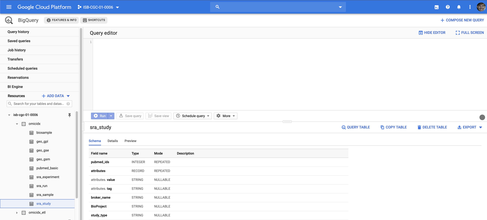
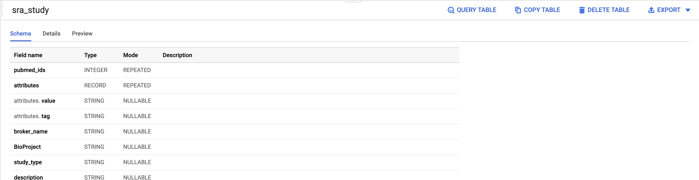
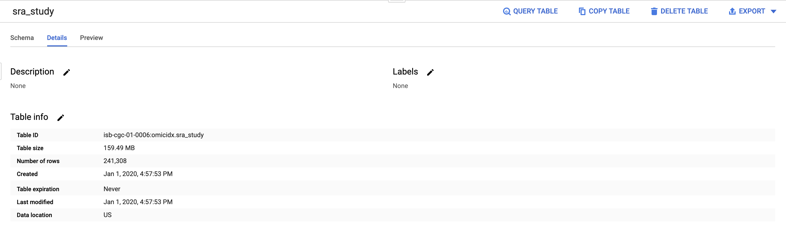
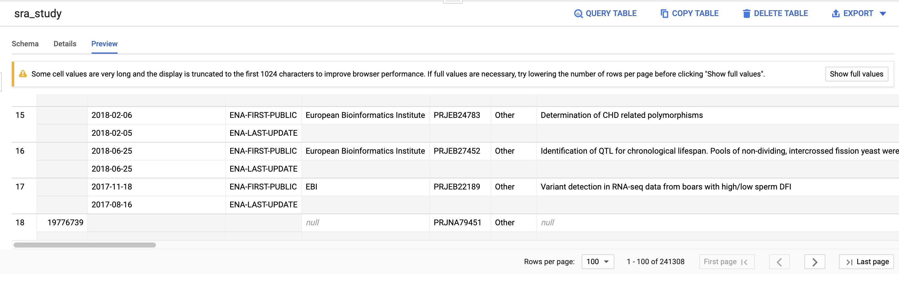
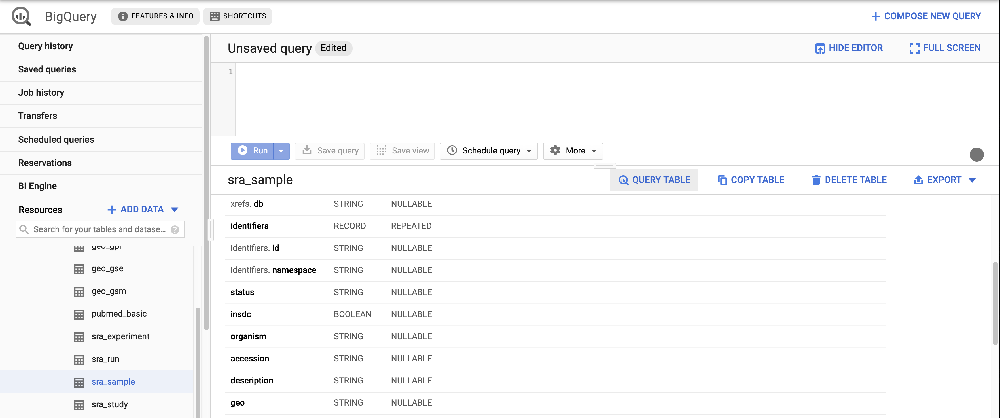
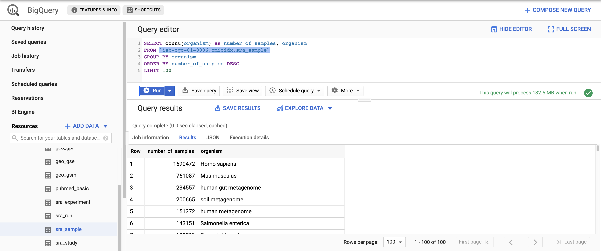

In this section, we will introduce SQL query concepts mainly through
examples. Here, we assume a basic understanding of SQL; there are many
good online tutorials for getting up-to-speed.

## Opening thoughts

Bigquery uses standard SQL, but it is not a traditional relational
database system. It is a columnar database, meaning that each column
of data is stored separately from the other columns. This has a couple
of implications. The first is that queries will generally be most
efficient if you can specify which columns you want returned (i.e.,
**no `select * from ...` queries!**). The second is that limiting
queries to return only required columns will *reduce costs* since
**Bigquery charges based on the amount of data scanned** in a query.

## Table exploration

As I mentioned in my [Opening thoughts][] section, Bigquery discourages `select *` queries. So, how can we get a sense of what is in the table in order to construct good queries?


```{r bigquerylanding, fig.cap='The OmicIDX dataset appears in the left "dataset" window.', out.width='100%', echo=FALSE}

```

```{r pinds, fig.cap='Clicking the "pin" button on the right will keep the OmicIDX dataset in your dataset navigator for easy access. ', out.width='100%', echo=FALSE}

```

```{r details, fig.cap='Clicking the "pin" button on the right will keep the OmicIDX dataset in your dataset navigator for easy access. ', out.width='100%', echo=FALSE}

```

```{r preview, fig.cap='Clicking the "pin" button on the right will keep the OmicIDX dataset in your dataset navigator for easy access. ', out.width='100%', echo=FALSE}

```

`r blogdown::shortcode('alert', title='Note', .content='For more in-depth step-by-step usage instructions for using the Bigquery web UI, including how to load your own data to Bigquery, see the [Bigquery web UI quickstart](https://cloud.google.com/bigquery/docs/quickstarts/quickstart-web-ui).')` 


## First query

```{r query-table-button, fig.cap='Clicking the "pin" button on the right will keep the OmicIDX dataset in your dataset navigator for easy access. ', out.width='100%', echo=FALSE}

```

```{r sample-org-query, fig.cap='Clicking the "pin" button on the right will keep the OmicIDX dataset in your dataset navigator for easy access. ', out.width='100%', echo=FALSE}

```


```sql
SELECT count(organism) as number_of_samples, organism
FROM `isb-cgc-01-0006.omicidx.sra_sample` 
GROUP BY organism 
ORDER BY number_of_samples DESC
LIMIT 100
```
